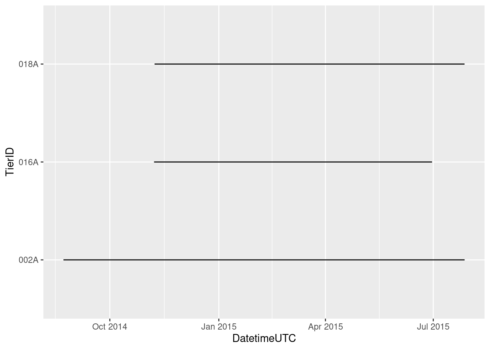
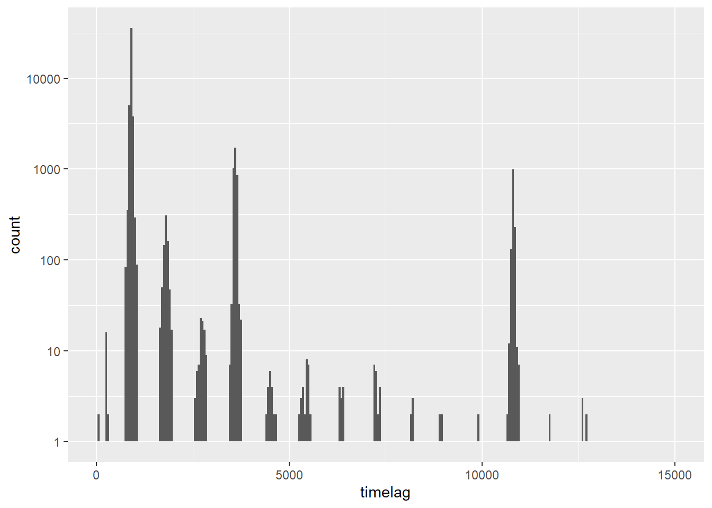
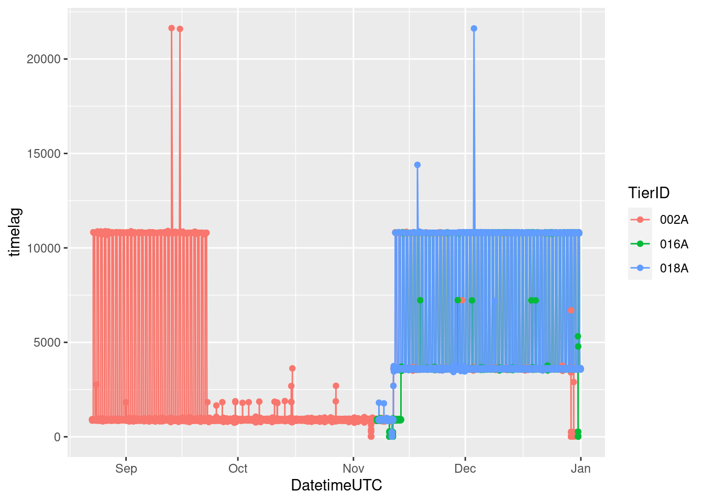
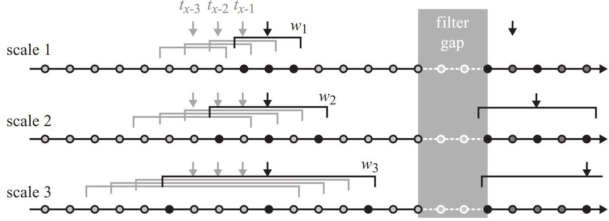
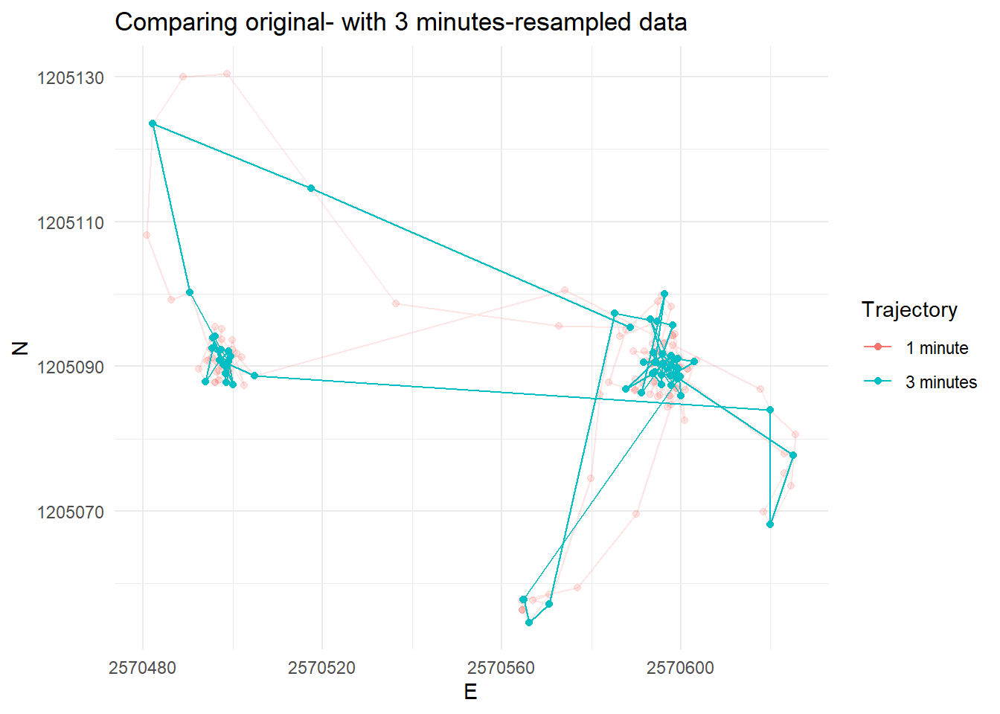
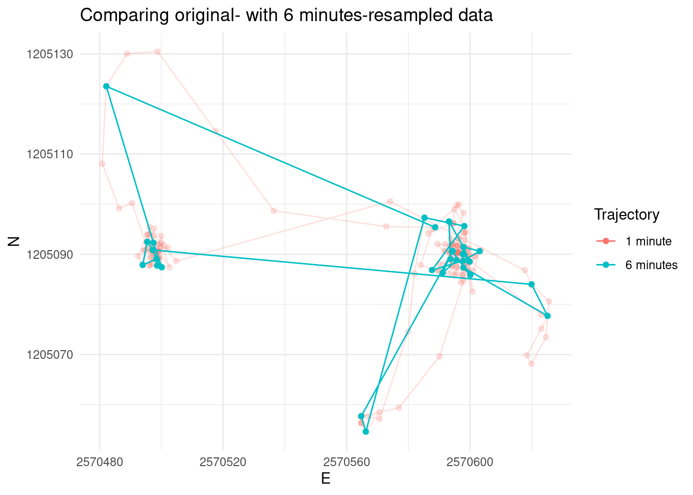
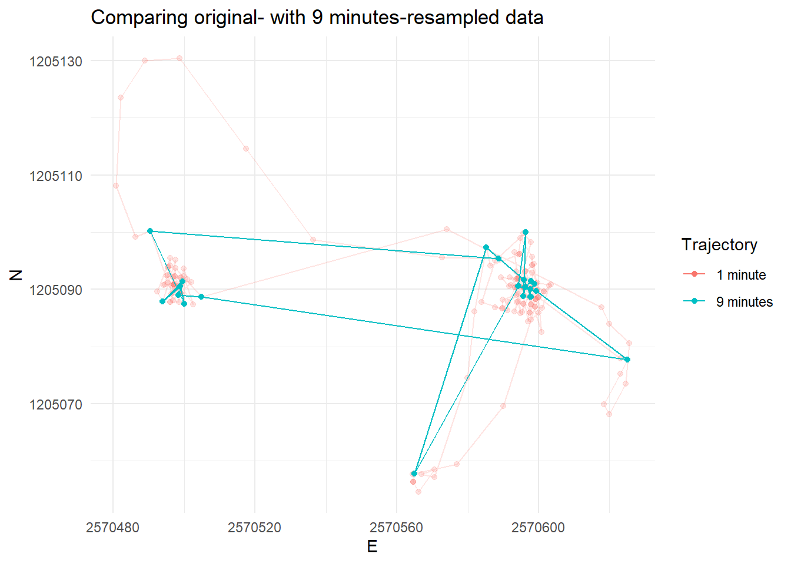
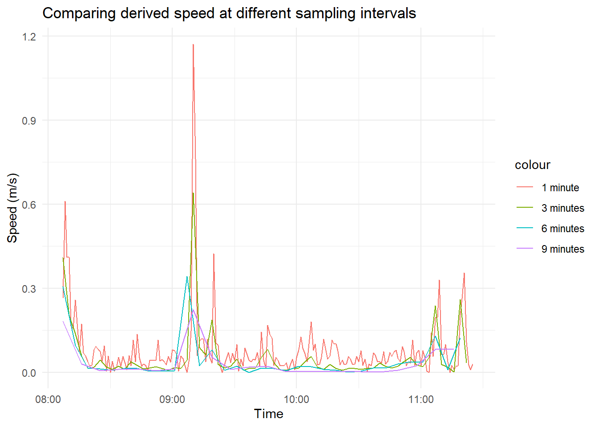

## Tasks and Inputs


- Open the RStudio Project you created for week 2 in [the preparation](#w2-project)
- Download the new wildboar movement data, and save it to your new project's directory [wildschwein_BE_2056.csv](https://github.com/ComputationalMovementAnalysis/FS21/raw/master/00_Rawdata/wildschwein_BE_2056.csv) (right click "Save target as..")
- Now, commit your changes to your repo like we did [last week](#w1-tasks-and-inputs) (see below):

\BeginKnitrBlock{rmdtip}<div class="rmdtip">1. Save your (R/RMarkdown) file
2. Switch to the "Git"-Tab in the pane in the top right corner
3. Click "commit" to open the "commit-Window"
4. Click in the checkbox next to the file(s) you want to commit
5. Add a commit message to explain what you are committing (e.g. "`initial commit`")
6. Click on "commit" to commit your changes</div>\EndKnitrBlock{rmdtip}


- Pushing our changes from our local repo the remote repo on Github
  - Simply click the green button "Push" in the Git tab in RStudio. 
  - Have a look at your remote Repository on Github (`https://github.com/YOUR-GITHUB-USERNAME/cma-week2`). Do you see the new files there? Contact us if this does not work.
  - **Note**: You do not need to push your changes to your remote repo after every commit. It's enough if you do this every few commits.

### Task 0: Import your data

Create a new R- (or RMarkdown-) file and begin with the following lines of code (adjust the path to your csv file accordingly).


```r
## Load the necessary libraries ################################################

library(readr)        # to import tabular data (e.g. csv)
library(dplyr)        # to manipulate (tabular) data
library(ggplot2)      # to visualize data
library(sf)           # to handle spatial vector data
library(terra)        # To handle raster data
library(lubridate)    # To handle dates and times

## Import the downloaded csv ##################################################

wildschwein_BE <- read_delim("00_Rawdata/wildschwein_BE_2056.csv",",") # adjust path

wildschwein_BE <- st_as_sf(wildschwein_BE, coords = c("E", "N"), crs = 2056, remove = FALSE)
```

Note: 

- that this dataset is already converted to EPSG 2056
- the coordinates are stored in the columns (`E`/`N`)
- setting `remove =  FALSE` preserves the original (`E`/`N`) columns, which come in handy later on

### Task 1: Getting an overview

Calculate the time difference between subsequent rows as described in the demo. You can calculate the time difference using the function `difftime()` in combination with `lead()`. 

- the function `difftime()` has an option `units`. Set this to `secs` to get the time difference in seconds
- use `as.integer()` to turn the output returned by `difftime()` into an integer.
- store the output in a new column (e.g. `timelag`)

Now inspect your data in more detail. Try to answer the following questions:

- How many individuals were tracked? 
- For how long were the individual tracked? Are there gaps?
- Were all individuals tracked concurrently or sequentially? 
- What is the temporal sampling interval between the locations?


Here are some exemplary visualisation you could produce to answer these questions. Can you now answer the above questions?

After completing the task, commit your changes to git using a good commit message (e.g. `completed task 1`).





### Task 2: Deriving movement parameters I: Speed {#w2-task2}

In this task we will derive some additional movement parameters from our trajectories. So far our trajectories only consist of a list of time-stamped spatial locations. So let's calculate the animal's steplength based on the Euclidean distance between two subsequent locations. 

You can calculate the Euclidean distance with the following formula: $$\text{distance} = \sqrt{(\text{E1} - \text{E2})^{2}+(\text{N1} - \text{N2})^{2}}$$

- `E1`, `N1` refers to the current location
- `E2`, `N2` refers to the consecutive location
- you can use `lead(E,1)` to address `E2`
- store the output in a new column (e.g. `steplength`)

  
Now calculate the animals' speed between consecutive locations based on `steplength` and the `timelag` (from the last task). What speed unit do you get?

After completing the task, commit your changes to git using a good commit message.


### Task 3: Cross-scale movement analysis

@laube2011 analyse animal movement across different scales (see below). In their paper, the authors suggest reducing the granularity of the data by subsetting the data to every n^th^ element. We will do the same on a dataset that includes 200 locations of a single wild boar with a constant sampling interval of 60 seconds. 

<div class="figure">

<p class="caption">(\#fig:unnamed-chunk-5)Black points are used in calculation of movement parameters (e.g. speed) at a given termporal scale (Laube and Purves, 2011)</p>
</div>

Download this dataset here: [caro60.csv](https://github.com/ComputationalMovementAnalysis/FS21/raw/master/00_Rawdata/caro60.csv) (right click: save target as..). Import it just like you imported the other wild boar data and save it to a new variable named `caro` (note that the locations are stored in EPSG 2056).

Now manually reduce the granularity of our sampling interval by selecting every 3^rd^, 6^th^ and 9^th^ position and save the output to `caro_3`, `caro_6`,`caro_9` accordingly.

Tip: There are many ways to go about this, we recommend using `seq()` where `from = 1`, `to = ` the length of the dataset and `by = n` (i.e. `3`, `6` or `9`). This creates an integer vector that can either used in `dplyr::slice()` or in row subsetting (type `?slice()` or `?"[.data.frame"` to get help on either of these methods). 


You should now have  4 datasets with different number of rows:


```r
nrow(caro)
## [1] 200
nrow(caro_3)
## [1] 67
nrow(caro_6)
## [1] 34
nrow(caro_9)
## [1] 23
```

Now calculate `timelag`, `steplength` and `speed` for these data sets, just as you did in the [last task](#w2-task2). To finish the task, compare the speeds visually in a line plot and also visualize the trajectories in a map (see examples below). Interpret the line plot, what do the different lines for the different temporal granularities tell you?

After completing the task, commit your changes to git using a good commit message.


```
## # A tibble: 67 × 6
##    TierID TierName CollarID DatetimeUTC                E        N
##    <chr>  <chr>       <dbl> <dttm>                 <dbl>    <dbl>
##  1 010C   Caro        13973 2015-09-15 08:07:00 2570589. 1205095.
##  2 010C   Caro        13973 2015-09-15 08:10:00 2570518. 1205115.
##  3 010C   Caro        13973 2015-09-15 08:13:00 2570482. 1205124.
##  4 010C   Caro        13973 2015-09-15 08:16:00 2570490. 1205100.
##  5 010C   Caro        13973 2015-09-15 08:19:00 2570497. 1205092.
##  6 010C   Caro        13973 2015-09-15 08:22:00 2570499. 1205091.
##  7 010C   Caro        13973 2015-09-15 08:25:00 2570500. 1205087.
##  8 010C   Caro        13973 2015-09-15 08:28:00 2570496. 1205094.
##  9 010C   Caro        13973 2015-09-15 08:31:00 2570497. 1205091.
## 10 010C   Caro        13973 2015-09-15 08:34:00 2570499. 1205091.
## # … with 57 more rows
```




### Task 4: Deriving movement parameters II: Rolling window functions


A different approach would be to *smoothen* the derived parameters using a [moving window function](https://docs.wavefront.com/images/5sec_moving_window.png). The `zoo` package offers a variate of moving window functions (`roll_*`). Install this package, load it into the session and use the function `roll_mean()` to smooth the calculated speed. Familiarise yourself with this function by working on some dummy data, for example:


```r
library(zoo)

example <- rnorm(10)
rollmean(example,k = 3,fill = NA,align = "left")
##  [1] -0.5049544 -0.3781283 -0.1273157  0.4523153  0.4534811  0.8658536
##  [7]  0.5452571  1.0210648         NA         NA
rollmean(example,k = 4,fill = NA,align = "left")
##  [1] -0.25933381 -0.22379720  0.06456868  0.45949282  0.70918920  0.56899826
##  [7]  0.88605495          NA          NA          NA
```

Now run `rollmean`on the `speed` variable of the subset (`caro`). Visualize the output from your moving windows and compare different window sizes (`k = `).
After completing the task, commit your changes to git using a good commit message. **Additionally**, push all your commits to your remote repository on Github by clicking the green upwards pointing arrow in the Git pane in RStudio.


<!-- ### Task 5 (optional): Calculate turning angles -->

<!-- Just like we did with `speed` in tasks 2 - 4, we could do the same with turning angles of the trajectory. If you like a challenge, try to calculate these with the same approach! Warning: this task is pretty complex. Note, as this task is optional, you don't have to include it in your mandatory submission of Exercise 2! -->

<!-- ```{r, code =  mydecrypt("12_Week2/task_5.R",".passphrase"), opts.label="solution_hideOutput"} -->
<!-- ``` -->


